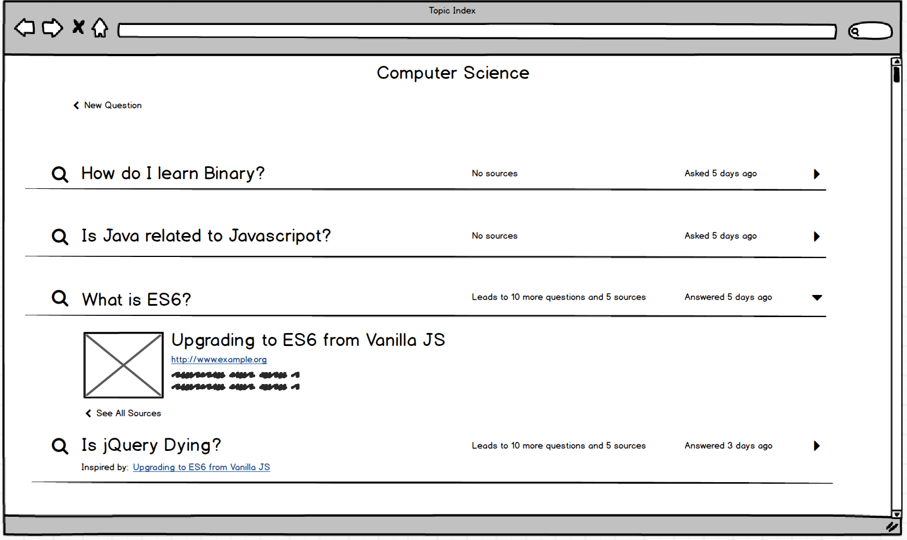

 

Use the [Waypoint](https://heroku-waypoint.herokuapp.com/) app on Heroku:
# Description

When we want to learn something deeply or do focused research, our greatest challenges are moving through the flood of available information, then capture the pieces that are most valuable to us in a meaningful way.

While there are many tools that help us to collect and catalogue sources of information (websites, books, videos, etc.), most of them ignore the context of the research. They help you save the information, but they don't keep track of why you looked for it in the first place, or how each element connects back to the big picture.

Of course, there are other tools for that, and a skilled learner or research might have a sophisticated process for integrating all of these tools into one coherent process. But these skills take practice and effort, and few people manage to master them.

__Waypoint__ is an early-stage web-based "proof-of-concept" prototype for _Veeo_, a software 'assistant' that quietly guides you through a focused and effective learning or research process, so you don't have to invent your own process to do good research. Veeo allows you to gather information from a wide range of sources while deeply engaging with each. It lets you visualize and navigate through the sources you gather by presenting them together in an intuitive networked map. Finally, it provides a simple process for synthesizing information from your entire discovery process, without losing track of a single reference.

<!-- TODO: Add schema  -->

## For Developers
### Wireframes

#### Welcome/login page:
- [x] v.0 Complete

--------------------

#### Topics index page:
- [x] v.0 Complete

--------------------

#### Topic show page:
- [ ] v.0 Complete

--------------------

#### Question sources index page:
- [ ] v.0 Complete

--------------------

#### Question notes index page:
- [ ] v.0 Complete

--------------------

#### Results index page:
- [ ] v.0 Complete

--------------------

#### Source/result show page:
- [ ] v.0 Complete

--------------------

#### Source/result show page with note in focus:
- [ ] v.0 Complete

--------------------
